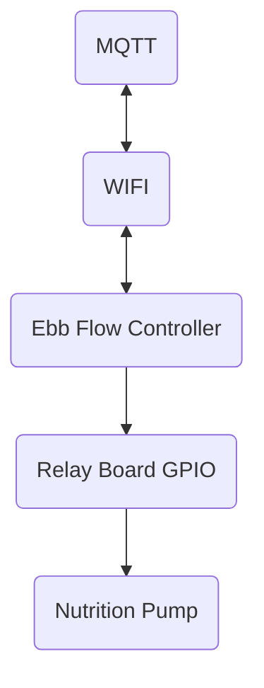

[](https://github.com/phofmeier/EbbFlowControl/actions/workflows/build.yml)
[](https://github.com/phofmeier/EbbFlowControl/actions/workflows/pre-commit.yml)

# Ebb Flow Control

This repository hold the software for a controller for an automated ebb flow hydroponic grow system. The controller runs on an ESP32 and can be configured via MQTT. The MQTT connection is additionally used to send status information and data for monitoring to an overall system.

## Build and Flash

The easiest way to build the software is to run the Docker devcontainer.
Inside the container you can use the espressif idf build environment. Run the following commands to build flash and monitor the device on the software.

```
idf.py build
idf.py flash
idf.py monitor
```

For configuration use the idf configuration environment. See the paragraph about the [configuration](#configuration) for more details.

## Hardware

The controller runs on a ESP32 with additional Hardware.

### Electronic Hardware List

- ESP32 Controller
- Relay Board
- Nutrition Pump

### Connections Overview



## Configuration

There are two different configurations. The build configuration which needs to be set before building the code for the controller and the runtime configuration which can be changed during runtime via MQTT messages.

### Build Configuration

The build configuration is done via the espressif idf configuration tool.
Run `idf.py menuconfig`to configure the build.

The most important configurations can be found in the main menu under `Application Configuration` the more less important one are inside the `Component Configuration`.

### Runtime configuration

The current configuration is saved in a persistent storage such that it is kept after an power cycle.

Always after connecting to an MQTT broker the current configuration is published via the `MQTT_CONFIG_SEND_TOPIC` (default: `efc/config`)

The controller can be configured during runtime via a MQTT message. The message needs to be send to the `MQTT_CONFIG_RECEIVE_TOPIC`(default: `efc/config/set`). The message needs to be formatted as json. After each attempt to change the configuration the new configuration is published.

If the configuration of a specific controller needs to be changed the config file needs to contain a `id` field with the board id of the controller.

Only the specified fields are update. If a key is not present in the configuration the current configuration is kept.

Example:
Setting the Pumping time to 120 seconds.

```json
{
  "id": 0,
  "pump_cycles": {
    "pump_time_s": 120
  }
}
```

#### Configuration values

##### Board ID

Key: `id`

The board id as `uint_8` value. A number between 0 and 255. If no board id is present all boards are updated. Else only the specified board is updated.

##### Nutrition Pump Configuration

Key: `pump_cycles`

| Key                   | Typ                  | Description                                                                                                                                                                         |
| --------------------- | -------------------- | ----------------------------------------------------------------------------------------------------------------------------------------------------------------------------------- |
| pump_time_s           | unsigned short       | Seconds the nutrition pump is on                                                                                                                                                    |
| nr_pump_cycles        | unsigned short       | The length of "times_minutes_per_day" list. Number needs to be between 0 and `MAX_NUMBER_PUMP_CYCLES_PER_DAY`(default: `24`)                                                        |
| times_minutes_per_day | List[unsigned short] | The actual timepoints the pump needs to run during a day in minutes of the day in local time. e.g. `[8*60, 13*60, 20*60+30]` relates to running the pump at 08:00, 13:00 and 20:30. |

## Data Output

The controller sends current data via MQTT to monitor the functionality. To use the data you need to subscribe to the specific channels.

### Current Configuration

Channel: `MQTT_CONFIG_SEND_TOPIC` (default: `efc/config`)

Data-Format: json

See the paragraph about the [Configuration Values](#configuration-values) for more details.

### Status

Channel: `MQTT_STATUS_TOPIC` (default: `efc/status`)

Data-Format: json

Data:
| Key | Typ | Description |
|---|---|---|
| id | uint_8 | Id of the specific board Integer between 0 and 255 |
| connection | string| Current connection status to the MQTT Broker. "connected" or "disconnected" |

Example:

```json
{
  "id": 0,
  "connection": "connected"
}
```
