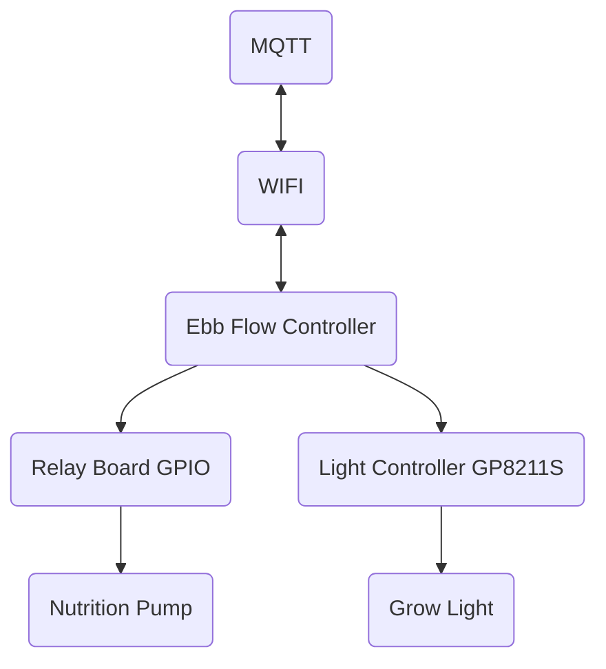

[](https://github.com/phofmeier/EbbFlowControl/actions/workflows/build.yml)
[](https://github.com/phofmeier/EbbFlowControl/actions/workflows/pre-commit.yml)

# Ebb Flow Control

This repository holds the software for a controller for an automated ebb flow hydroponic grow system. The controller runs on an ESP32 and can be configured via MQTT. The MQTT connection is additionally used to send status information and data for monitoring to an overall system.

## Quick Start

Use the script `scripts/download_and_flash_release.sh` to download and flash the newest released software version to your ESP32 Board.

### First configuration

Scan the QR Code to connect to the Wifi.


Scan the QR Code to show the Configuration Website.


## Over the Air (OTA) updates

There are two different apps built for this project.

### Factory application

The factory application does not hold the normal application. It only serves for a first initial configuration and downloading the latest main application. It starts a WiFi Access Point and hosts a webpage to configure the device for the first time. The WiFi and webpage can be joined by scanning the QR codes shown [here](#first-configuration). After submitting the correct configuration it downloads the latest version of the main application and starts it.

### Main application

The main application is always running. It serves all the implemented features. It can be updated over the air by always having two copies of the application. When a new version is released, it is downloaded automatically at around midnight and is written on an extra partition. Be aware that it never overrides the factory app. After a successful update, the new code needs to run for more than 24h to be considered valid. A restart during this timeframe would consider the update as invalid and the old app would be booted again.

## Build and Flash

If you do not need any special configuration you can just download and flash the prebuilt release version with the script located at `scripts/download_and_flash_release.sh`.

If you need to change anything, the easiest way to build the software is to run the Docker devcontainer.
Inside the container you can use the espressif idf build environment.

### Factory vs Application build

For building the factory or main application the profile files can be used. The following list shows the how to use them.

- Build application: `idf.py @profiles/app build`
- Flash application: `idf.py @profiles/app flash`
- Build factory: `idf.py @profiles/factory build`
- Flash factory: `idf.py @profiles/factory flash`

For configuration use the idf configuration environment. See the paragraph about the [configuration](#configuration) for more details.

## Hardware

The controller runs on an ESP32 with additional hardware.

### Electronic Hardware List

- ESP32 Controller
- Relay Board
- Nutrition Pump
- Grow Light with 0 V - 10 V Dimmer input
- GP8211S I2C to 0V - 10 V DAC

### Connections Overview


```mermaid
graph TD

WIFI(WIFI)
MQTT(MQTT)

NutritionPump(Nutrition Pump)
RelayBoard(Relay Board GPIO)
GrowLight(Grow Light)
GP8211S(Light Controller GP8211S)
EbbFlowControl(Ebb Flow Controller)

MQTT <--> WIFI;
WIFI <--> EbbFlowControl;
EbbFlowControl --> RelayBoard
RelayBoard --> NutritionPump
EbbFlowControl --> GP8211S
GP8211S --> GrowLight
```

## Configuration

There are two different configurations. The build configuration which needs to be set before building the code for the controller and the runtime configuration which can be changed during runtime via MQTT messages.

### Build Configuration

The build configuration is done via the espressif idf configuration tool.
Run `idf.py menuconfig` to configure the build.

The most important configurations can be found in the main menu under `Application Configuration`; the less important ones are inside the `Component Configuration`.

### Runtime configuration

The current configuration is saved in persistent storage so that it is kept after a power cycle.

Always after connecting to an MQTT broker the current configuration is published via the `MQTT_CONFIG_SEND_TOPIC` (default: `ef/efc/static/config`)

The controller can be configured during runtime via a MQTT message. The message needs to be sent to the `MQTT_CONFIG_RECEIVE_TOPIC` (default: `ef/efc/config/set`). The message needs to be formatted as JSON. After each attempt to change the configuration, the new configuration is published.

If the configuration of a specific controller needs to be changed the config file needs to contain a `id` field with the board id of the controller.

Only the specified fields are updated. If a key is not present in the configuration, the current configuration is kept.

Example:
Setting the Pumping time to 120 seconds.

```json
{
  "id": 0,
  "pump_cycles": {
    "pump_time_s": 120
  }
}
```

#### Configuration values

##### Board ID

Key: `id`

The board id as `uint_8` value. A number between 0 and 255. If no board id is present, all boards are updated; otherwise, only the specified board is updated.

##### Nutrition Pump Configuration

Key: `pump_cycles`

| Key                   | Typ                  | Description                                                                                                                                                                         |
| --------------------- | -------------------- | ----------------------------------------------------------------------------------------------------------------------------------------------------------------------------------- |
| pump_time_s           | unsigned short       | Seconds the nutrition pump is on                                                                                                                                                    |
| nr_pump_cycles        | unsigned short       | The length of "times_minutes_per_day" list. Number needs to be between 0 and `MAX_NUMBER_PUMP_CYCLES_PER_DAY` (default: `24`)                                                        |
| times_minutes_per_day | List[unsigned short] | The actual timepoints the pump needs to run during a day in minutes of the day in local time. e.g. `[8*60, 13*60, 20*60+30]` relates to running the pump at 08:00, 13:00 and 20:30. |

##### Grow Light Configuration

Key: `light`

| Key                | Typ                        | Description                                                      |
|--------------------|----------------------------|------------------------------------------------------------------|
| nr_light_changes   | uint8_t                    | Number of light changes per day (length of the lists below)                                  |
| times_min_per_day  | List[uint16_t] | Timepoints for light changes in minutes of the day (local time)  |
| intensity          | List[uint16_t] | Intensity values for each light change (0-0x7FFF)                 |
| rise_time_min      | List[uint8_t]  | Rise time in minutes for each light change                       |

## Data Output

The controller sends current data via MQTT to monitor the functionality. To use the data you need to subscribe to the specific channels.

### Current Configuration

Channel: `MQTT_CONFIG_SEND_TOPIC` (default: `ef/efc/static/config`)

Data-Format: json

See the paragraph about the [Configuration Values](#configuration-values) for more details.

### Status

Channel: `MQTT_STATUS_TOPIC` (default: `ef/efc/static/status`)

Data-Format: json

Data:
| Key | Typ | Description |
|---|---|---|
| id | uint_8 | Id of the specific board Integer between 0 and 255 |
| connection | string | Current connection status to the MQTT Broker. "connected" or "disconnected" |
| rssi_level | int | Connection strength of the Wifi connection. -100 if an error occurs. |
| version | string | Version string of the current running version. |

Example:

```json
{
  "id": 0,
  "connection": "connected"
}
```

### Pump

Channel: `MQTT_PUMP_STATUS_TOPIC` (default: `ef/efc/timed/pump`)

Data-Format: json

Data:
| Key | Typ | Description |
|---|---|---|
| id | uint_8 | Id of the specific board Integer between 0 and 255 |
| ts | string | Current timestamp in ISO 8601 format including microseconds |
| status | string | "start" when starting to pump and "stop" when stopping  |

### Light

Channel: `MQTT_LIGHT_STATUS_TOPIC` (default: `ef/efc/timed/light`)

Data-Format: json

Data:
| Key       | Typ      | Description                        |
|-----------|----------|------------------------------------|
| id        | uint_8   | Id of the specific board           |
| ts        | string   | Current timestamp in ISO 8601      |
| intensity | uint16_t | Light intensity value (0-0x7FFF)    |

Example:
```json
{
  "id": 0,
  "ts": "2026-03-15T12:34:56.123456+0100",
  "intensity": 32768
}
```
